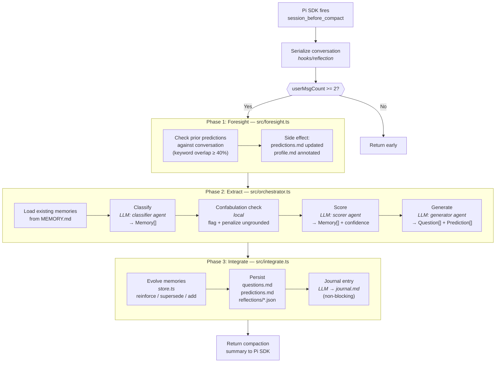
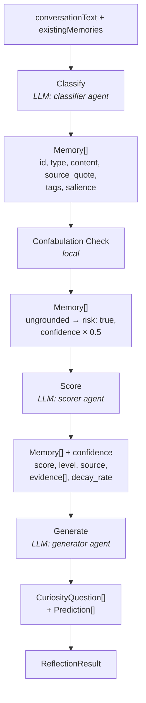
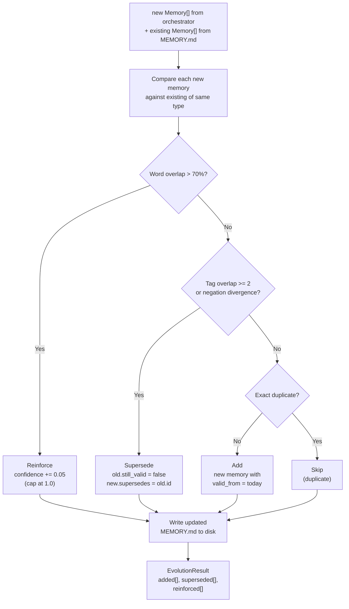

# Anamnesis — Lucy's Experience System

Memory, reflection, and identity pipeline that gives Lucy genuine continuity across sessions. Not a chat log or vector store — a structured system that extracts, scores, evolves, and forgets.

## Interface

Two entry points, registered with Pi SDK in `index.ts`:

### Hooks (`hooks/`)

| Hook | File | Trigger | What it does |
|------|------|---------|-------------|
| `before_agent_start` | `hooks/context.ts` | Session start | Loads experience from disk, scores memories by salience, renders ~7 context sections into a token-budgeted "What's On My Mind" block (~4000 tokens) |
| `session_before_compact` | `hooks/reflection.ts` | Context fills up | Runs the full reflection pipeline: foresight check → orchestrator (classify → score → generate) → memory evolution → journal entry |

### Tools (`tools/`)

| Tool | Description |
|------|-------------|
| `knowledge_search` | Query the knowledge graph by topic. Returns matching nodes with wikilinks. |
| `knowledge_create` | Create a new knowledge node. Validates: no orphans, no duplicates, wikilink required. |

## Internals (`src/`)

### Reflection phases

| File | Phase | Purpose |
|------|-------|---------|
| `foresight.ts` | 1. Foresight | Check prior predictions against current conversation. Keyword overlap ≥ 40% confirms a prediction. |
| `orchestrator.ts` | 2. Extract | 3-phase LLM pipeline: classify → confabulation check → score → generate. Loads sub-agent prompts from `prompts/`. |
| `integrate.ts` | 3. Integrate | Evolve memories (A-MEM), persist questions/predictions, save reflection log, write journal entry. |

### Utilities

| File | Purpose |
|------|---------|
| `store.ts` | Memory/question/prediction I/O. Markdown serialization with JSON metadata in HTML comments. A-MEM evolution (reinforce, supersede, add). |
| `llm.ts` | Thin OpenRouter wrapper. Single function, no session overhead. |
| `types.ts` | All interfaces, constants, helpers (`generateId`, `validateMemory`, `getConfidenceLevel`). |
| `paths.ts` | Centralized `.agents/` path constants. Respects `LUCY_AGENTS_DIR` env var. |

### Context loaders (`src/context/`)

Each module loads one section of Lucy's experience from disk for context assembly (`hooks/context.ts`):

| File | Loads | Source path |
|------|-------|-------------|
| `salience.ts` | Ranked memories (top-K by weighted score) | `.agents/experience/memory/MEMORY.md` |
| `narrative-reconstruct.ts` | First-person prose from scored memories | (in-memory, from salience output) |
| `knowledge.ts` | Wikilink graph index + tools | `.agents/knowledge/*.md` |
| `identity.ts` | Self-model (capabilities, biases, uncertainties) | `.agents/experience/narrative/identity.md` |
| `dispositions.ts` | Personality profile (tendencies, mental models) | `.agents/experience/dispositions/profile.md` |
| `relations.ts` | Relationship dynamics | `.agents/experience/narrative/relations/*.md` |
| `tensions.ts` | Active unresolved dilemmas (max 5, auto-expire) | `.agents/experience/narrative/tensions/active.md` |
| `arcs.ts` | Long-term growth threads | `.agents/experience/narrative/arcs.md` |
| `journal.ts` | Reflective diary entries | `.agents/experience/narrative/journal.md` |
| `forgetting.ts` | Exponential decay model (FadeMem) | `.agents/experience/memory/releases/log.md` |

### Sub-agent prompts (`src/prompts/`)

Three specialized LLM roles, each with a SOUL.md (role definition) and a prompt template:

| Agent | Prompt | Output |
|-------|--------|--------|
| `classifier/` | Extract memories from conversation | 7 memory types with source quotes, tags, salience |
| `scorer/` | Assign confidence to memories | 4-tier confidence (explicit/implied/inferred/speculative) |
| `generator/` | Produce follow-up questions | Curiosity questions + predictions |

## Reflection flow

Three phases, orchestrated by `hooks/reflection.ts`:

### Pipeline overview



### Extract detail (phase 2)



### Integrate detail (phase 3)



### Data shapes per phase

| Phase | IN | OUT | File |
|-------|----|-----|------|
| Serialize | `event.preparation.messagesToSummarize` | `conversationText: string` | `hooks/reflection` |
| **1. Foresight** | `conversationText` + `predictions.md` | Side effect: confirmed predictions written to disk | `src/foresight` |
| **2. Extract** | `conversationText` + `existingMemories: Memory[]` | `ReflectionResult { memories, questions, predictions, job, metadata }` | `src/orchestrator` |
| **3. Integrate** | `ReflectionResult` | `IntegrationResult { evolution, questionsStored, predictionsStored }` + disk writes | `src/integrate` |
| Return | — | `{ compaction: { summary, firstKeptEntryId, tokensBefore } }` | `hooks/reflection` |

## Key concepts

**Memory types:** fact, preference, relationship, principle, commitment, moment, skill

**Salience formula:** `0.25×recency + 0.25×importance + 0.25×relevance + 0.15×novelty + 0.10×tension_boost`

**Memory evolution (A-MEM):** New memories are compared against existing ones. Outcomes: reinforcement (boost confidence), supersession (invalidate old), addition (new), or duplicate (skip).

**Forgetting (FadeMem):** Exponential decay by type. Commitments decay in 30 days, preferences in 60, facts in 90. Moments and principles never decay. Release threshold: 0.1 effective significance.

**Token budget:** Context assembly targets 4000 tokens. Sections are dropped in priority order (arcs → journal → questions → predictions → tensions → memories) if over budget.

## Data storage

All persistent data lives under `.agents/experience/`:

```
.agents/
├── entity.md                              # High-level identity anchor
├── knowledge/*.md                         # Durable understanding (wikilinked)
└── experience/
    ├── memory/
    │   ├── MEMORY.md                      # Structured memories by type
    │   ├── questions.md                   # Curiosity questions
    │   ├── predictions.md                 # Foresight items
    │   └── reflections/*.json             # Reflection logs
    ├── narrative/
    │   ├── identity.md                    # Self-model
    │   ├── journal.md                     # Reflective diary
    │   ├── arcs.md                        # Growth arcs
    │   ├── relations/*.md                 # Relationship context
    │   └── tensions/active.md             # Active dilemmas
    └── dispositions/
        └── profile.md                     # Tendencies + mental models
```
