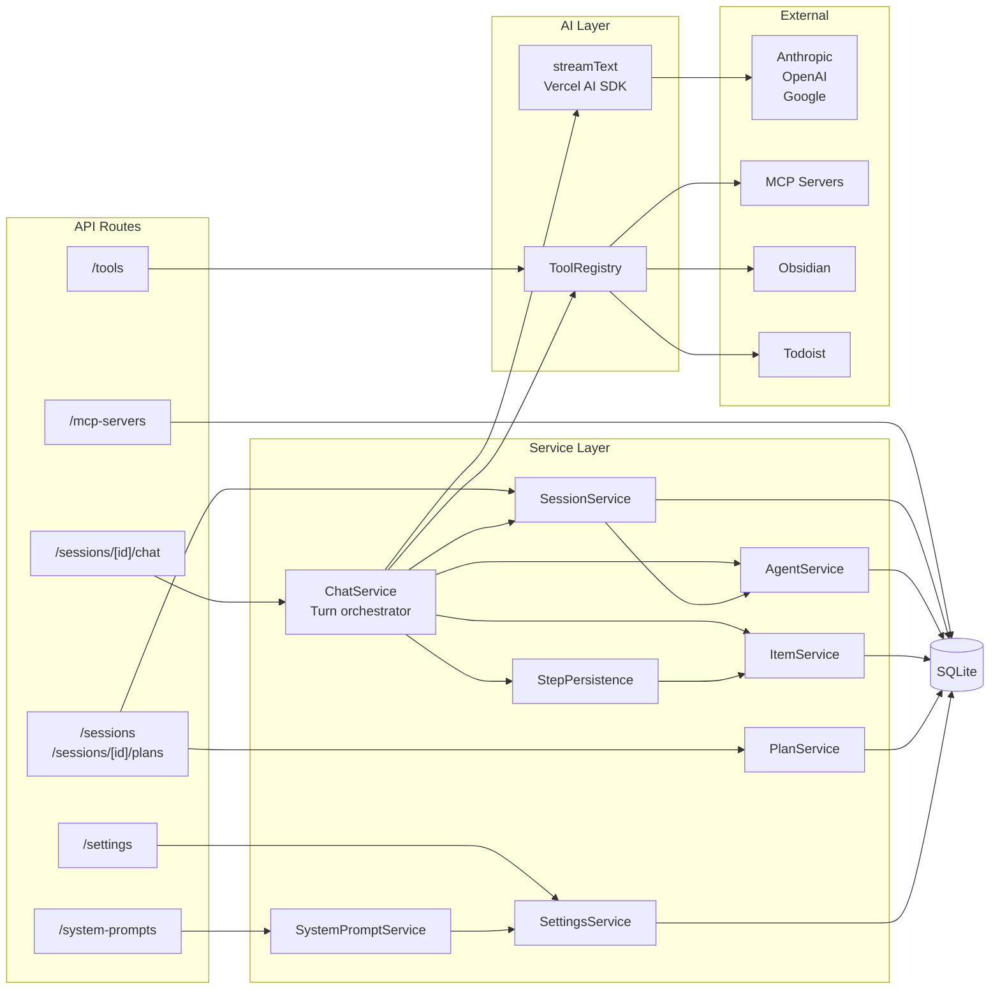
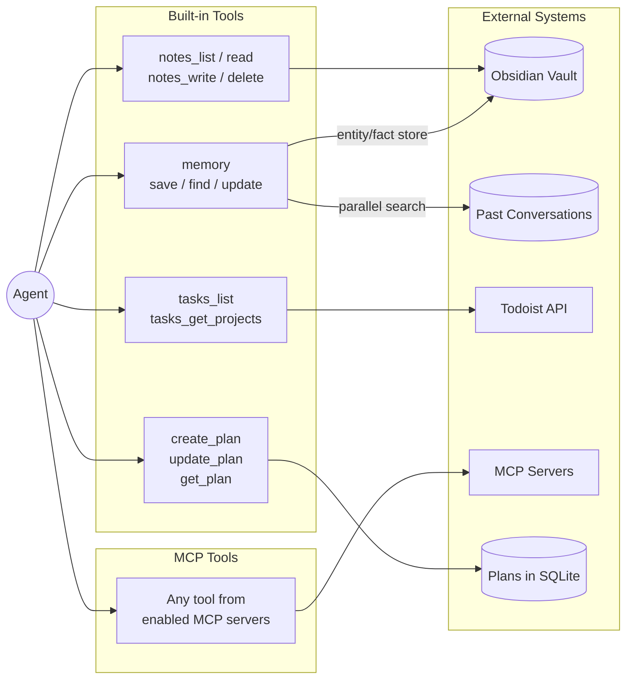

# Lucy

An AI assistant with a desktop app (Electron + Next.js) and cloud backend (Next.js API server). The desktop app connects to the cloud backend for all data and AI operations.

## Quick Start

```bash
# Terminal 1: Start cloud backend
cd backend
npm install
cp .env.example .env.local   # Fill in JWT_SECRET + API keys
npm run db:push              # Initialize database schema
npm run dev                  # Starts on port 3001

# Terminal 2: Start desktop app
npm install
npm rebuild better-sqlite3   # Rebuild native module
npm run dev                  # Starts Electron + Next.js on port 8888
```

The frontend at :8888 makes API calls to the backend at :3001. Set `NEXT_PUBLIC_API_URL` in `desktop/renderer/.env.local` to change the backend URL.

## Architecture

Lucy has two stacks: a desktop app (Electron + Next.js) and a cloud backend (standalone Next.js API server). The desktop frontend connects to the cloud backend via an authenticated API client.

```
Electron (main/)
  └── Next.js UI (renderer/src/app/)
        ├── Pages ─── use hooks ─── compose components
        └── Hooks ─── API Client ─── Cloud Backend (backend/) ─── Services ─── DB
```

### System Call Map

How API routes, services, and external systems connect:



### Agent Tool Map

What an agent can reach through tool calls during a conversation:



### Documentation Architecture (Lego Modules)

The backend is documented as composable modules at multiple levels.

- Each backend module directory has its own short `README.md`.
- A module README describes only its own stable contract: purpose, public API, and how to use it.
- Orchestration-layer READMEs do not explain child internals; they link downward instead.
- To go deeper, follow the next README in the module graph.

Start from:

- `backend/README.md`
- `backend/src/lib/README.md`
- `backend/src/app/api/README.md`

## Module Map

| Module | Path | Description |
|--------|------|-------------|
| [Backend Root](backend/README.md) | `backend/` | Backend overview and module-doc contract |
| [Backend Source](backend/src/README.md) | `backend/src/` | Layer map across routes, services, and capabilities |
| [Backend API Layer](backend/src/app/api/README.md) | `backend/src/app/api/` | Route groups and boundary rules |
| [Backend Library](backend/src/lib/README.md) | `backend/src/lib/` | Capability + orchestration module map |
| [Desktop Main](desktop/main/README.md) | `desktop/main/` | Electron main process, IPC, window management |
| [Desktop App Layer](desktop/renderer/src/app/README.md) | `desktop/renderer/src/app/` | Next.js frontend app routes/layout |
| [Desktop Components](desktop/renderer/src/components/README.md) | `desktop/renderer/src/components/` | React UI components |
| [Desktop Hooks](desktop/renderer/src/hooks/README.md) | `desktop/renderer/src/hooks/` | Data/state hooks |
| [Desktop Library](desktop/renderer/src/lib/README.md) | `desktop/renderer/src/lib/` | Frontend infrastructure (API client, services, tools) |

## Commands

### Desktop App (root)
| Command | Description |
|---------|-------------|
| `npm run dev` | Start development mode (Electron + Next.js hot reload) |
| `npm run build` | Build production app (DMG/installer) |
| `npm rebuild better-sqlite3` | Rebuild native module for Node.js |
| `npm run db:push` | Push schema changes to database |
| `npm run db:studio` | Open Drizzle Studio |

### Cloud Backend (`cd backend/`)
| Command | Description |
|---------|-------------|
| `npm run dev` | Start backend server on port 3001 |
| `npm run build` | Build for production (standalone output) |
| `npm run db:push` | Push schema to SQLite or Postgres |
| `npm run db:studio` | Open Drizzle Studio |

## Key Concepts

### Multi-Agent System
Sessions contain a hierarchy of agents. Each agent has its own conversation thread (items) and can spawn child agents via tool calls.

### Polymorphic Items
Conversation entries are stored in a single `items` table with a `type` discriminator:
- `message` - User/assistant/system messages
- `tool_call` - Tool invocations with args
- `tool_result` - Tool outputs linked via `callId`
- `reasoning` - Model reasoning traces

### Tool Sources
Tools come from multiple sources, unified through the registry:
- `mcp` - Model Context Protocol servers
- `builtin` - Built-in tools (memory, plans, tasks, notes)
- `integration` - Third-party integrations (Todoist, Obsidian)
- `agent` - Sub-agents as tools

## Development

See [CLAUDE.md](CLAUDE.md) for detailed development guidelines.

## License

MIT
