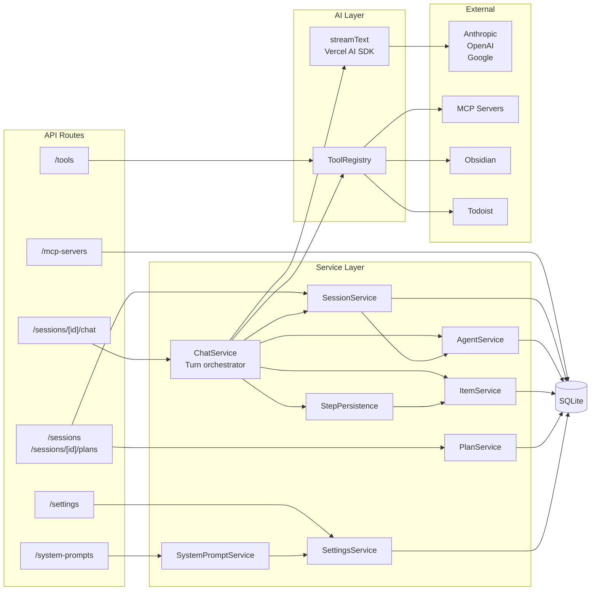
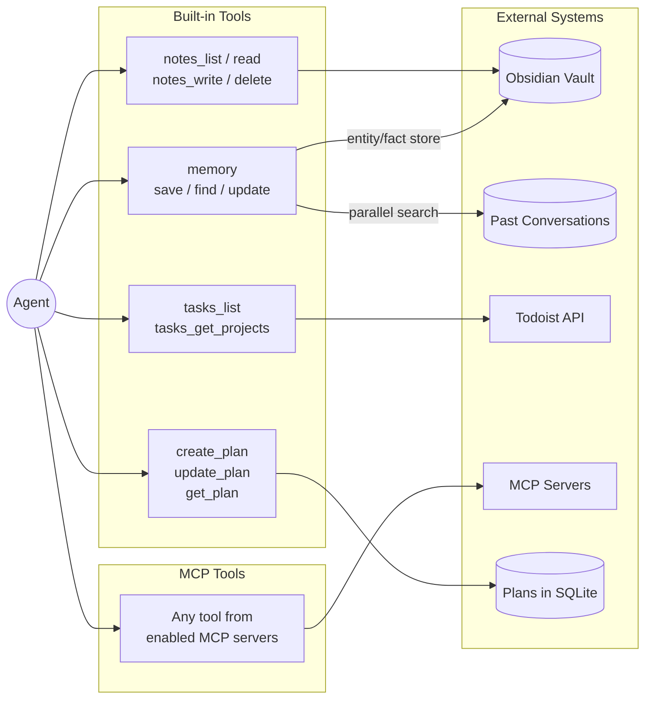

# Lucy

A desktop AI assistant built with Electron + Next.js (Nextron). Runs locally with SQLite and connects to AI providers (Anthropic, Google, OpenAI).

## Quick Start

```bash
npm install
npm run db:push          # Initialize database
npm rebuild better-sqlite3  # Rebuild native module
npm run dev              # Start development
```

## Architecture

Lucy is a 3-layer desktop app: an Electron shell, a Next.js renderer (pages + API routes), and a core library (AI, database, tools, services).

```
Electron (main/)
  └── Next.js App (renderer/src/app/)
        ├── Pages ─── use hooks ─── compose components
        └── API Routes ─── call services ─── use AI + tools ─── persist to DB
```

### System Call Map

How API routes, services, and external systems connect:



### Agent Tool Map

What an agent can reach through tool calls during a conversation:



## Module Map

| Module | Path | Description |
|--------|------|-------------|
| [Electron Main](main/README.md) | `main/` | Main process, IPC, window management, preload bridge |
| [App Layer](renderer/src/app/README.md) | `renderer/src/app/` | Next.js pages and API routes |
| [Components](renderer/src/components/README.md) | `renderer/src/components/` | React UI components (chat, sidebar, settings) |
| [Hooks](renderer/src/hooks/README.md) | `renderer/src/hooks/` | React hooks for state, streaming, and async data |
| [Library](renderer/src/lib/README.md) | `renderer/src/lib/` | Core library: AI, database, services, tools, integrations |

## Commands

| Command | Description |
|---------|-------------|
| `npm run dev` | Start development mode |
| `npm run build` | Build production app (DMG/installer) |
| `npm run db:push` | Push schema changes to database |
| `npm run db:studio` | Open Drizzle Studio |

## Key Concepts

### Multi-Agent System
Sessions contain a hierarchy of agents. Each agent has its own conversation thread (items) and can spawn child agents via tool calls.

### Polymorphic Items
Conversation entries are stored in a single `items` table with a `type` discriminator:
- `message` - User/assistant/system messages
- `tool_call` - Tool invocations with args
- `tool_result` - Tool outputs linked via `callId`
- `reasoning` - Model reasoning traces

### Tool Sources
Tools come from multiple sources, unified through the registry:
- `mcp` - Model Context Protocol servers
- `builtin` - Built-in tools (memory, plans, tasks, notes)
- `integration` - Third-party integrations (Todoist, Obsidian)
- `agent` - Sub-agents as tools

## Development

See [CLAUDE.md](CLAUDE.md) for detailed development guidelines.

## License

MIT
